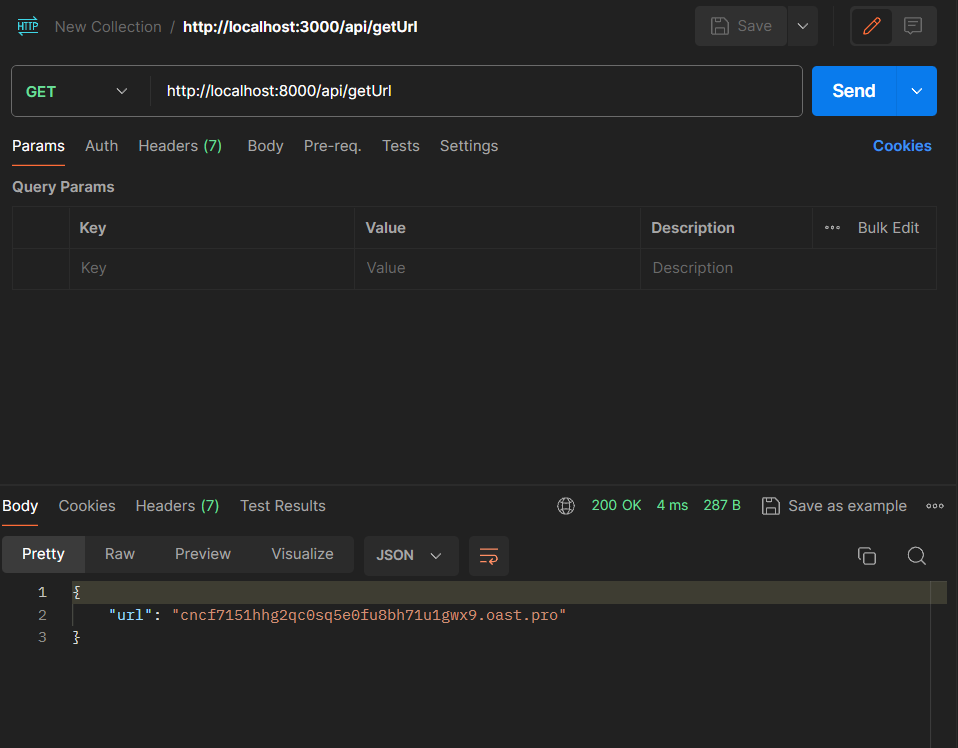
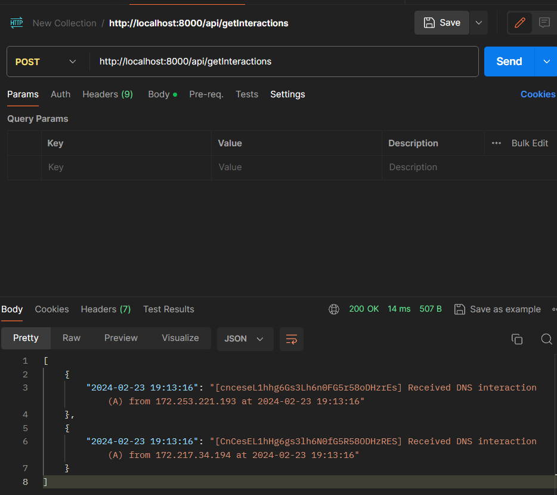
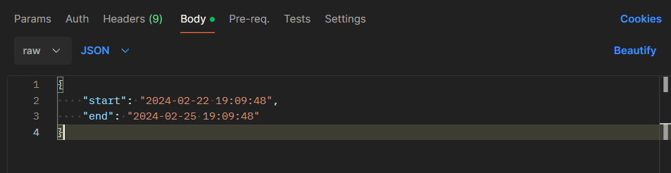

# Interactsh wrapper service

This application is developed in Node.js which has 2 API endpoints to interact with interactsh-client

## Installation

### a) On docker:

### b) On local maching: using git repository

Before using the service you need to have go and interactsh-client installed

1. install go: https://go.dev/doc/install

2. install interactsh-client:

```
go install -v github.com/projectdiscovery/interactsh/cmd/interactsh-client@latest
```

3. clone this repo:

`

4. open terminal in the project directory and run the following commands:

```
    npm install
    node app.js
```

## Demo

I have used postman to do all the API calling

### to get valid endpoints do a get request on "/"
expected output->
```
{"valid-endpoints": [
   {"GET": "/api/getURL"},
   {"POST": "/api/getInteractions"}
]}
```

### 1) api/getUrl

sends the url of the client we are connected to in interact-client



### 2) api/getInteractions

before sending this API request make some interactions to the interactsh-client in a different terminal

```
    ex: ping 'url'
```

sends a list of all interactions made to the specific link



optional parameters which defines a range,
add the start and end timestamp in the body of the POST request


